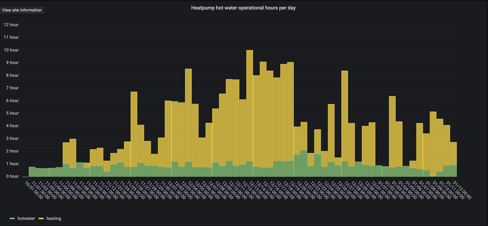
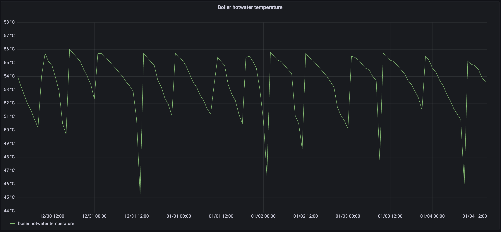
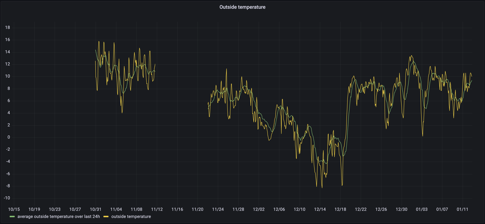
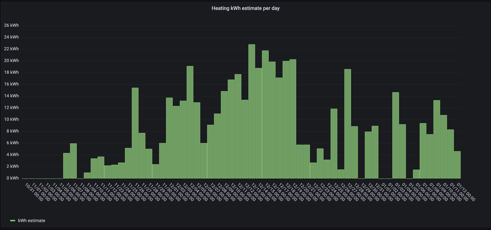

# Energy comsumption of a heatpump during the winter
In this small report, the data collected from the heatpump will be anaysed and evaluated. The goal of the report is inform readers whom may be considering to get a heatpump as an alternative heatpump. In the report, you will found out how a heatpump works and the reason why the heatpump uses lot of energy during the winter.

### Validity of the analysis
All the graphs of information used for this analysis comes from one singular heatpump. Therefore the validaty of the anaylsis can be questioned. However just recent, the heatpump had control, and came through with no mechanical problems. The type of heatpump used for this project provides heating for a family of 4, is a ground-source heatpump and uses 2.6 kwh to heat 207m squared of housing, however can the analysis of the data collected be useful for everybody. Why? this is because this winter had a diversification of temperatures providing a lot of instresing trends in correlation between outside temperature and operational hours of the heatpump.

### Operational hours of the heatpump

Graph 1 - heatpump operational hours per day

Graph 1 shows the operational hours per day of the heatpump since around 11/01/22. A heatpump has two systems it needs can heat up, once a time. The heatpump can heat the house, which is the yellow part of the bar, or the heatpump can heat up the tapwater of the house. Based from graph 1, heating of tapwater was often constant around 1 hour. Between 12/16 and 12/20 more heating for tapwater was needed. During this period, another family of 4 was present in the house. Indicating the use of warm tapwater equals the time the heatpumps needs to operate. 

Graph 2 - the temperature of the water heater barrel

The reason why the heatpump always needs to operate although no warm water is used in the house. As shown in the graph, the temperature of the water heater barrel, or the temperature of the barrel holding the warm tapwater is constantly dropping in temperature and is heated constantly back to 56 celcius. This is caused by the barrel not being perfectly isolated, meaning the heatpump constantly needs to add heat/ energy to the barrel.

Graph 1 - heatpump operational hours per day

As seen in Graph 1, the yellow part of the bar graph/ the time heating the house is the opposite of heating the tapwater, it is not controlled. To explore why it is in that way, we must look at the outside temperature.

Graph 3 - outside temperature for the last 90days

NOTE: the reason why data is missing is because the raspberry pi crashed and was not much noticed later, but the single trend on the left of graph 3 serves useful.

When comparing graph 1 and 3, there is a clear relation between outside temperature and time the heatpump is heating the house (note heatpump heating the house is constant). The relation between the graphs is that when temperatures tend to be low, the operational hours of the heatpump heating the home is high. This especially can be seen at 12/18 when outside temperatures reached -8 degrees and the heatpump spend a total of 7/8 hours heating the home. Opposite can be seen early November, when temperatures were high and heating of the house was no more than 2 hours. This can be explained scientifically since heat temperature always tries to move to low temperatures and equalize "presure" (“Heat Transfer”). The reason why the cold weather does not affect the cooling down of the barrrel with tapwater is because the barrel is placed underground level, better isolated, and is exposed to room temperature and not exposed to direct cold air like an house. Furthermore is it a loss less efficient to heat up bigger environments, resulting in longer heating hours.

Sometimes the heatpump does not heat the house at all, the explantion behind that is when it is warm and sunny, the house can be heated using the solar collectors  on the roof of the house. However was this not counted in the investigation, between during the winter (time of collecting data), the solar collectors are most of time off from activity.

## The cost of running a heatpump

Graph 4 - usage kWh per day of heatpump

Some heatpumps can use a lot of energy. The one used for the experiment used 2.6 kWh. Which can be quite a lot, since it can have a operational time of 10 hours during cold winters. This can be quite costly considering the prices in Europe have been increasing. For example the average kWh use of the heatpump per day this warm winter was around 10KWh. Taking the current electricty prices of €40c/kWh. €4 euros per day, €120 euros per month just soley to power the heatpump. The disadvantage of the heatpump is that it is expensive, including installation cost (especially) of a ground-source heatpump. Making heatpumps unfortuanly not the best options for some people. 

However if the cost are less the problem. The advantage of the heatpump that it is your own source of heating only relying on electricty, which is often produced within own country. A heatpump only uses electricty because the heatpump is able to compress matter of low temperature into higher temperatures. Which the matter is often a liquid or air coming from the outside. This compress mechanism is performed by a compressor (of gas), which is the main energy consumer when heating your home (“Hoe Werkt Een Warmtepomp?”). This makes the heatpump a very reliable and independent source of energy. Which is very sustainable (because most energy/ heat comes from the outside) and can be handy in times of war, such as now, whereas gas prices are higher than electricity.

## Conclusion
Although not a lot of arguments were reviewed in this report. From the information covered can a heatpump be very useful for a lot of households, esecially sinds it is a very sustainable and indepdent source of heat. However can the prices of installing and running a heatpump skyrocket, and is often only beneficial in the long-term over 10 years. Especially in the current situation, a heatpump is for many households not the best option and is it the best to look for something else. However for the people whom have additional money saved, installing a heatpump over the long-term will be worth it.

