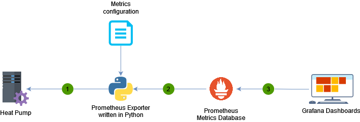
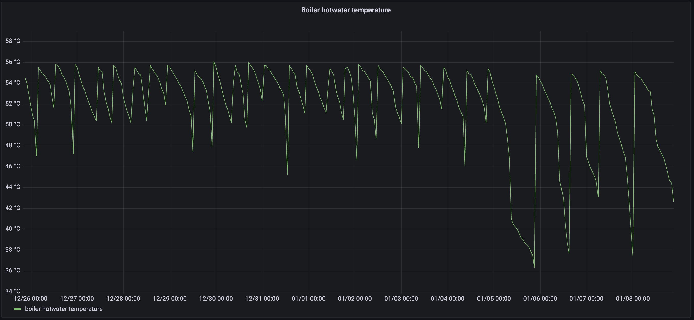

# Milans personal project


## Introduction
The MYP personal project is a long term project held in grade 10. In the project, we should explore something which inspires or intrests us. My learning goal of this project is to program and able to process, analyse/ draw conclusions from data. Furthermore would I test my learning goal through creating a program which is able to store the data from the heat pump, and a small report analysing the trends given by the heat pump.

I had chosen to upload the program on Github, because it is serves as evidence and it is easy to explain the program using this platform. Furthermore can it be useful for others, whom perphaps want to observe their heatpump's performance.


## Heatpumps
The heatpump is the source of my small report, or is the device the main program had to collect/ aks data from. A heatpump extracts heat from a cold source (air or ground) and transfers it to our houses (this process is able reversable). To perform this process, the heatpumps are installed with sensors, measuring metrics such as outside temperature, and to use that data to predict how much it needs to heat the house. The heatpump is able to do this because it has its own small program. Which the main program (Prometheus exporter) is communciating with, storing the data of all the "relevant" sensors. 

## About the heatpump used
The heatpump used for this experiment was the ground source heatpump, meaning the natural heat the heatpump collects is constant. This is because ground sources lay deep in the ground, and are not affected by the temperature climate above soil. The brand of the heatpump is the Alpha Innotec heatpump.


## validity of the project


## General setup  
The following diagram provides an overview of the components in my setup.



When collecting and displaying the data from the heatpump, at whole process needs to be runs behind the scene. furthermore can we see th

### Heatpump
Alpha Innotec heatpump

### Prometheus Exporter


### Prometheus Metrics Database


### Grafana Dashboards




All components except the heatpump itself are running on a tiny raspberry pi linux server in our 'meterkast'.

-- insert photo here --


## The heatpump data exporter
In order to get the heatpump metrics in the Prometheus metrics database I had to write a so called prometheus exporter program. This program convert the heatpump metrics into a format that Prometheus understands.

First I needed to analyse the metrics that can be requested from the heatpump controller. From the heatpump manual I learned that it was using a Luxtronic controller board (a kind of mini computer) that I could use to retrieve metrics. The documentation for this controller board was quite scarce but fortunately I found a web page documenting the available metrics.


## metric configuration 
In the main program of the project, additional files were used because of the different reasons. One of these files contained the metrics used. Why? because it was easier to create/ configure the metrics in another file than have the metric configuration in the exporter program(main program). Which could create a lot of errors. Furthermore could the additional file for the metric configuration be written in another programming language. YAML was chosen because it is able to create configuration files with any programming language and designed for human readability.

https://github.com/m-swart/heatpump/blob/0b64a68b2c0fb870224c23b20c2f8e317ef1ed67/metric.yml

As you can see, YAML made it very easy to define to the program what were all the metrics through 'metrics:', and were the symbol minus '-' used to define each individual metric. 

```yaml
metrics:
  - name: heatpump_outdoor_temp_celcius
    key: ID_WEB_Temperatur_TA
    type: gauge
- name: heatpump_operational_total_seconds
    key: ID_WEB_Zaehler_BetrZeitWP
    type: counter
```
As seen in the YAML file, each metrics consist out of a name, key and type. The name is just the name given to the metric to identify it. Looking at the example, from the name we can understand the metric is the outdoor temperature measured by the heatpump. The key is the essentially the name/ key the program needs to use when asking the heatpump for data about the outdoor temperature. This is because the heatpump uses a programming language called Luxtronik, and otherwise the heatpump would not know what the program is asking for. As last is the type, meaning the type of data. In the whole file, the only types are guage and counter. Guage is value which is able to decrease or increase, such as temperature. Counter is a value which only able to increase, such as age.
These types are important to display with the data, because otherwise prometheus does not understand how to store the data.


### program outline (read metric configuration first for better of program outline)
I have written the Prometheus exporter program in Python. Main reason for using Python is that I was told it was easy to learn and that there already was a standard library available to allowed me to communicate with the heatpump controller.

https://github.com/m-swart/heatpump/blob/89292fa02aeb39303c1c5cff3516f7b67c08f38e/heatpump.py#L1-L3


The first three lines of code tell the program to install/ import certain libraries. So that the program understands what to do when referred to work with on the libraries further on the program. A library is a addiotional file of code to be imported to your own code. Benefits of this are that existing code can be reused.

For this program, in total 3 librariers were (pip3) installed and used. Library Luxtronik allows interaction between the heatpump controller, essential to collect data. Flask is a web application framework for local/ small uses, fask can create a website on your own IP adress, which could serve as a place to display data. Yaml is a library that helps with reading configuration files in the [YAML](https://en.wikipedia.org/wiki/YAML) format.


Having installed the libraries needed for this project. The thing missing to complete the set-up for the program to understand the code.

One of the missing things is the YAML file containing the variables the program has to collect data about (through asking the heatpump).
https://github.com/m-swart/heatpump/blob/89292fa02aeb39303c1c5cff3516f7b67c08f38e/heatpump.py#L5-L7
Line 5 is a #comment, adding no meaning to the code. However in Line 6, the code tells te program to open a local file called metric.yml --> with premission only to preview through 'r'. Standing for reading. 
Line 7 is a follow up to Line 6 telling the program to safeload/ preview and understand the data. Caused by '='. telling the program to view the data, through using the yaml library.

Everytime the program is to perform a new action, not a follow up to prior lines of code. A new "paragraph" is used, so it is clear which paragraph does what.
https://github.com/m-swart/heatpump/blob/89292fa02aeb39303c1c5cff3516f7b67c08f38e/heatpump.py#L9
Line 9 is a function, defined by '='. It is a widely used function asking the program to create a Flask application using Flask. The code essentially tells the library to use library 'Flask' --> and current location of program '__name__' to create a 'app', or application.

The main and last part of the code is essentially a loop, to collect data of each variable listed in 'metric.yml. Containing all the variables needed to collect. The YAML will be explained later on.
https://github.com/m-swart/heatpump/blob/89292fa02aeb39303c1c5cff3516f7b67c08f38e/heatpump.py#L11-L22
Line 11 is the trigger for the loop L12-L22 to happen.Line 11 creates a specific URL/ app route so the application knows when to handle incoming web request. When that specific URL '/metrics' is executed, Line 12 creates a function called metrics. Which is followed by a loop defined by ':' and how the following lines are spaced more to the right/ connected to the function. The program ingores Line 13 since it is a #comment. Line 14 asks the program to connect to a heatpump. Using 'Luxtronik' and the local ip-adress to connect. Since it is a fucntion, the code asks the program to perform the next lines using the knowledge it needs to use Luxtronik to communicate with the heatpump. 

metrics:
  - name: heatpump_outdoor_temp_celcius
    key: ID_WEB_Temperatur_TA
    type: gauge

Line 15 tells the program to prepare a response text to the computer requesting the URL. ("") The response is still blank. So, Line 16 ask the program to get collect data for each individual metric in 'metrics.yml' from the heatpump. Lines 16 does this by creating a loop of L17-19. The program is able to identify each individual metric with the use of -. Line 17 ask to program to find the value of that metric. Through using the key of that metric. For isntance using the example of the metric above. The program, already connected to the heatpump (since L12-L22 is a loop). Asks the heatpump the value of key ID_WEB_Temperatur_TA using Luxtronik. Nothing is yet done with the response, but remember it.

In Line 18, the program is asked to begin writing a response to be added in the blank space of line 15 ("") through 'metric_text +='. The program is asked to add  '# TYPE {0} {1}\n' to the reponse. {0} {1} are "strings". Whereas {0} represents the code 'metric['name']', and {1} represents 'metric['type']'. Which both have the program look in the YAML file. The reason why {0} and {1} reperesent something is becasue of '.format' a rule in phyton creating these representations. The /n after {1} makes the program create a new line if something else would be added to the response later on.


Using the example above, Line 18 would create this: #TYPE heatpump_outdoor_temp_celcius guage. 

Line 19 is about the same as Line 18. As explained earlier '+=' makes the program add the text/ reponse to 'metric_text'. However this time the program adds the name and the value of the metric to the response. The program gets the name of the metric from the YAML file and value was the response from the heatpump collected in Line 17. The value in Line 17 was earlier not added to reponses because no reponse space was given, and no add command was given. Which is '+='.

Using the example above, Line 19 would create this:
heatpump_outdoor_temp_celcius 8.9

The reason why the name and value have to be put in this specific order is because otherwise prometheus is not able to read/ take in the information. Promotheus is needed to fully automise this process of requesting the data and storing it.

Using the example above, the whole loop of L17-L19 creates this (example of 1 metric):
# TYPE heatpump_outdoor_temp_celcius gauge
heatpump_outdoor_temp_celcius 8.9

Line 20 tells the program to make 'metric_text' the final response to the request. This response contains the work of L17-L19 of all the metrics in metric.yml because it is a loop of L16. Whereas this final response display is changed in Line 21. Although changing the format of the letters does not change anyhting to the program. When checking if the program was working, this format was easier to read.

Line 22 is the end of the loop. Where the program is told to send the final response to the computer requesting using Flask.


## Response
The program returns the following output in the format expected by Prometheus. See [documentation](https://prometheus.io/docs/instrumenting/exposition_formats/#text-format-example).

```
# TYPE heatpump_outdoor_temp_celcius gauge
heatpump_outdoor_temp_celcius 8.9
# TYPE heatpump_outdoor_temp_avg_celcius gauge
heatpump_outdoor_temp_avg_celcius 9.9
# TYPE heatpump_flow_in_temp_celcius gauge
heatpump_flow_in_temp_celcius 18.8
# TYPE heatpump_flow_out_temp_celcius gauge
heatpump_flow_out_temp_celcius 18.7
# TYPE heatpump_flow_out_target_temp_celcius gauge
heatpump_flow_out_target_temp_celcius 20.6
# TYPE heatpump_hotwater_measured_celsius gauge
heatpump_hotwater_measured_celsius 54.8
# TYPE heatpump_hotwater_target_celsius gauge
heatpump_hotwater_target_celsius 57.0
# TYPE heatpump_groundsource_in_temp_celsius gauge
heatpump_groundsource_in_temp_celsius 21.3
# TYPE heatpump_groundsource_out_temp_celsius gauge
heatpump_groundsource_out_temp_celsius 19.2
# TYPE heatpump_operational_total_seconds counter
heatpump_operational_total_seconds 42836049
# TYPE heatpump_operational_heating_seconds counter
heatpump_operational_heating_seconds 30253720
# TYPE heatpump_operational_hotwater_seconds counter
heatpump_operational_hotwater_seconds 12582318
# TYPE heatpump_operational_cooling_seconds counter
heatpump_operational_cooling_seconds 58770240
# TYPE heatpump_compressor_impulses counter
heatpump_compressor_impulses 37643
```

## Grafana dashboard


## Things I learned

* Making simple programs in Python
* Working with GIT version control system
* Creating dashboards in Grafana
* Writing documentation in Markdown and publishing it on Github. 
* .......